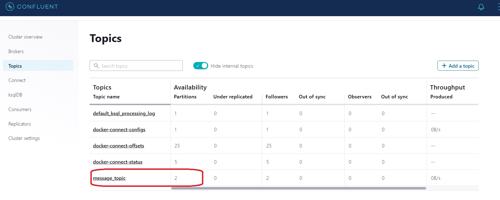
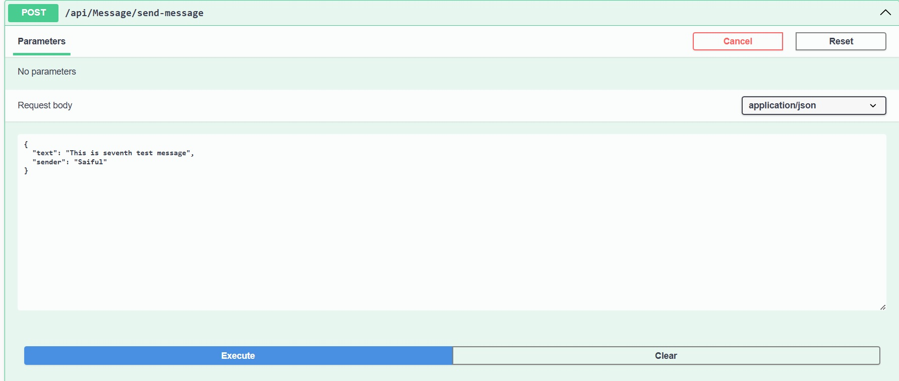
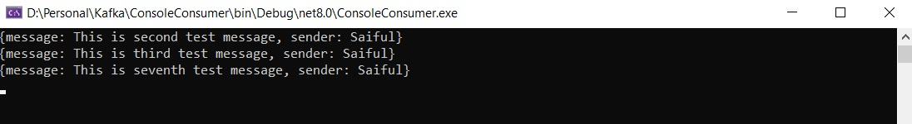
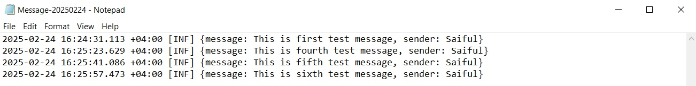

# Kafka Message Topic Sample

## Overview
This is a **Kafka** sample project demonstrating how to send messages to a topic (message_topic), which has two partitions, and consume them using multiple consumers. In this case, messages are distributed from both partitions between the two consumers.

1. **A console application**

2. **A web API with a background service**

This setup ensures efficient testing of message processing with multiple consumers.

## Features
**Kafka Message Broker for Asynchronous Messaging**

**Partitioned Topic to distribute messages across multiple consumers**

**Multiple Consumers for concurrent message processing**

**Consumer Group Mechanism for automatic load balancing**

## Tech Stack
**.NET 8**

**Confluent Kafka**

**ASP.NET Web API (Background Service)**

**Console Application**

## Screenshot of message distribution between two consumers and Kafka topic setup

## Kafka Topic Configuration with Two Partitions

## Send message from web api publisher

## Consume message by console app

## Consume message by web api background service

